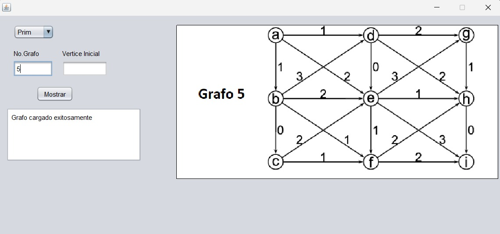

# Grafos


## Descripción
Esta es una aplicación de escritorio desarrollada en **Java (Swing)** que permite visualizar y ejecutar algoritmos fundamentales de Teoría de Grafos. El proyecto busca implementar estructuras de datos propias (Listas Ligadas y Grafos basados en listas ligadas) desde cero, sin depender de las colecciones estándar de Java.

El sistema permite cargar grafos desde archivos de texto, visualizarlos gráficamente sobre un mapa o imagen de fondo, y calcular rutas o árboles de expansión.

## Características Principales

### Algoritmos Implementados
* **Algoritmo de Prim:** Para encontrar el Árbol de Expansión Mínima (MST).
* **Algoritmo de Kruskal:** Enfoque alternativo para MST detectando ciclos.
* **Algoritmo de Dijkstra:** Para encontrar el camino más corto entre dos vértices considerando pesos.
* **Búsquedas:** Recorridos en Anchura (BFS) y Profundidad (DFS).

### Aspectos Técnicos
* **Estructuras de Datos Propias:** Implementación manual de Listas Simplemente Ligadas (`ListaLigada.java`) para gestionar la memoria dinámicamente.
* **Visualización Gráfica:** Uso de `Graphics2D` en `JPanel` para dibujar nodos, aristas y resaltar los caminos resultantes en tiempo real.
* **Persistencia:** Lectura de configuración de grafos (aristas, pesos y coordenadas visuales) mediante archivos planos `.txt`.

## Estructura del Proyecto
El proyecto sigue la arquitectura MVC (Modelo-Vista-Controlador) simplificada:
* `src/Grafo`: Lógica matemática, algoritmos y gestión de archivos.
* `src/Listas` y `src/Nodos`: Estructuras de datos dinámicas personalizadas.
* `src/Interfaz`: Componentes visuales y renderizado del grafo.
* `src/Main`: Ventana principal (`JFrame`) y control de eventos.

## Instalación y Uso

1.  **Requisitos:** Tener instalado Java JDK (8 o superior) y NetBeans (opcional, pero recomendado).
2.  **Clonar el repositorio:**
    ```bash
    git clone [https://github.com/tu-usuario/visualizador-grafos.git](https://github.com/tu-usuario/visualizador-grafos.git)
    ```
3.  **Recursos:** Asegúrate de que la carpeta `recursos/` esté en la raíz del proyecto, ya que contiene las imágenes y la definición de los grafos.
4.  **Ejecución:**
    * Abre el proyecto en NetBeans.
    * Ejecuta el archivo `Main/MainF.java`.
    * Ingresa el número de grafo a cargar (ej. `5`, `7`, `8` según los archivos en `recursos`), pulse enter para vizualizar.
    * Selecciona el algoritmo (Prim, Kruskal, Dijkstra), define los vértices y presiona **Mostrar**.

## Capturas de Pantalla

### Menú Principal
<p align="center">
  
</p>

### Prim
<p align="center">
  
</p>

### Kruskal
<p align="center">
  
</p>

### Ejecución del Algoritmo (Dijkstra)
<p align="center">
  
</p>
  
  ## Notas sobre la Visualización
El mapeo de los nodos sobre el mapa de fondo se realizó mediante una estimación estática visual basada en la resolución de la imagen original.

Debido a la naturaleza manual de esta calibración, es posible observar ligeras desviaciones visuales en el punto de anclaje de algunas aristas (líneas) con respecto al centro geométrico del nodo.

## Aviso Legal y Créditos 
Este software utiliza recursos gráficos con fines exclusivamente educativos y demostrativos.
Las imágenes son propiedad de sus respectivos autores y no se busca lucro con su distribución.

## Autor
* **Manuel Montes Pioquinto** - *Ingeniería en Ciencias de la Computación*

---
*Este proyecto fue desarrollado como parte de mi formación en estructuras de datos.*
